# Arquitectura General del Sistema RAG + ML

El siguiente diagrama representa los tres flujos principales del sistema, que integran los servicios de **procesamiento de documentos**, **recuperación aumentada (RAG)** y **análisis mediante Machine Learning**.


---

## Flujo 1: Upload de Documentos (Azul)

**Objetivo:** Procesar y almacenar documentos PDF para su posterior consulta e integración en el sistema de recuperación de información.

**Pasos del flujo:**

1. El usuario sube un archivo PDF al endpoint **`/upload`**.
2. El **Ingest Service** procesa el archivo:

   * Guarda el archivo físico en el directorio `temp/`.
   * Extrae el texto del documento.
   * Divide el texto en *chunks*.
   * Genera **embeddings (384D)**.
3. Los embeddings y metadatos se almacenan en **PostgreSQL**.
4. Se actualizan las siguientes tablas:

   * `documents`
   * `langchain_pg_embedding`
   * `langchain_pg_collection`

---

## Flujo 2: Chat con RAG (Verde)

**Objetivo:** Permitir al usuario interactuar con el sistema mediante consultas naturales sobre los documentos procesados.

**Pasos del flujo:**

1. El usuario envía una consulta al endpoint **`/chat`**.
2. El **Chat Service** coordina el proceso de recuperación y generación.
3. El **Query Service** realiza una **búsqueda vectorial** en `langchain_pg_embedding`.
4. Se recuperan los **Top-K documentos** más relevantes.
5. Se construye un **prompt con contexto** y se envía a la **DeepSeek API (LLM externo)**.
6. La respuesta generada se devuelve al usuario a través del servicio de chat.

---

## Flujo 3: Análisis ML (Rojo)

**Objetivo:** Ejecutar análisis avanzados sobre los embeddings almacenados utilizando técnicas de Machine Learning.

**Pasos del flujo:**

1. El usuario solicita un análisis mediante los endpoints **`/ml/*`**.
2. La **LLM API** envía una petición TCP al puerto **`5555`**.
3. El **TCP Server (services_ML)** recibe la solicitud y procesa los datos.
4. Se ejecutan los siguientes procesos de ML:

   * **Clustering:** `HDBSCAN`
   * **Topic Modeling:** `BERTopic`
   * **Recommendations:** Basadas en similitud
   * **Visualization:** `UMAP 2D`
5. Se leen los embeddings desde PostgreSQL.
6. Los resultados se almacenan en las siguientes tablas:

   * `ml_clusters`
   * `ml_topics`
   * `ml_visualizations`
   * `ml_recommendations`
7. El servidor **responde vía TCP** al cliente con los resultados procesados.
8. Los resultados se devuelven finalmente al usuario.

---

## Componentes Clave

| Componente               | Descripción                                                   | Puerto         |
| ------------------------ | ------------------------------------------------------------- | -------------- |
| **services_LLM**         | Servicio principal de orquestación y endpoints REST (FastAPI) | `8000`         |
| **services_ML**          | Servicio para análisis ML (FastAPI + TCP Server)              | `8001`, `5555` |
| **PostgreSQL (AWS RDS)** | Base de datos con soporte para **pgvector**                   | —              |
| **DeepSeek API**         | Modelo LLM externo para generación de texto contextualizado   | —              |
| **temp/**                | Carpeta temporal para almacenamiento físico de PDFs           | —              |

---

# Diagramas Mermaid

## 1. Arquitectura General del Sistema


---

## 2. Flujo 1: Upload de Documentos

```mermaid
sequenceDiagram
    actor Usuario
    participant Upload as /upload Endpoint
    participant LLM as services_LLM
    participant Ingest as Ingest Service
    participant Storage as temp/
    participant DB as PostgreSQL

    Usuario->>Upload: 1. POST /upload (PDF)
    Upload->>LLM: Recibe archivo
    LLM->>Ingest: Procesar documento

    Ingest->>Storage: 2. Guardar PDF físico
    Storage-->>Ingest: Confirmación

    Ingest->>Ingest: 3. Extraer texto (PyPDF2)
    Ingest->>Ingest: 4. Chunking (RecursiveCharacterTextSplitter)
    Ingest->>Ingest: 5. Generar embeddings (384D)

    Ingest->>DB: 6. INSERT INTO documents
    Ingest->>DB: 7. INSERT INTO langchain_pg_embedding
    Ingest->>DB: 8. INSERT INTO langchain_pg_collection

    DB-->>Ingest: Confirmación
    Ingest-->>LLM: Metadata del documento
    LLM-->>Usuario: 200 OK + document_id, chunks_created

    Note over Usuario,DB: Documento procesado y listo para consultas
```



---

## 3. Flujo 2: Chat con RAG


---

## 4. Flujo 3: Análisis ML

```mermaid
sequenceDiagram
    actor Usuario
    participant ML_EP as /ml/* Endpoints
    participant LLM as services_LLM
    participant TCP_Client as ML TCP Client
    participant TCP_Server as TCP Server<br/>(Puerto 5555)
    participant ML_API as services_ML
    participant ML_Feat as ML Features<br/>(HDBSCAN, BERTopic, UMAP)
    participant DB as PostgreSQL

    Usuario->>ML_EP: 1. POST /ml/clustering {user_id}
    ML_EP->>LLM: Recibe solicitud
    LLM->>TCP_Client: 2. Preparar request TCP

    TCP_Client->>TCP_Server: 3. TCP Request<br/>(JSON over TCP)
    Note over TCP_Client,TCP_Server: Comunicación en Puerto 5555

    TCP_Server->>ML_API: 4. Decodificar y enrutar
    ML_API->>ML_Feat: 5. Ejecutar análisis

    ML_Feat->>DB: 6. SELECT embedding FROM langchain_pg_embedding
    DB-->>ML_Feat: Embeddings (384D)

    ML_Feat->>ML_Feat: 7. UMAP (384D → 5D)<br/>para clustering
    ML_Feat->>ML_Feat: 8. HDBSCAN clustering
    ML_Feat->>ML_Feat: 9. BERTopic modeling
    ML_Feat->>ML_Feat: 10. UMAP (384D → 2D)<br/>para visualización
    ML_Feat->>ML_Feat: 11. Calcular similitud

    ML_Feat->>DB: 12. INSERT INTO ml_clusters
    ML_Feat->>DB: 13. INSERT INTO ml_topics
    ML_Feat->>DB: 14. INSERT INTO ml_visualizations
    ML_Feat->>DB: 15. INSERT INTO ml_recommendations

    DB-->>ML_Feat: Confirmación
    ML_Feat-->>ML_API: Resultados del análisis

    ML_API->>TCP_Server: 16. Codificar respuesta
    TCP_Server->>TCP_Client: 17. TCP Response<br/>(JSON)

    TCP_Client-->>LLM: Resultados ML
    LLM-->>Usuario: 18. 200 OK {clusters, topics, viz, recommendations}

    Note over Usuario,DB: Análisis ML completado y almacenado
```



---

## 5. Esquema de Base de Datos


---

## 6. Diagrama de Componentes Técnicos


---

## 7. Flujo de Comunicación TCP

```mermaid
sequenceDiagram
    participant LLM as services_LLM<br/>TCP Client
    participant TCP as TCP Server<br/>:5555
    participant ML as services_ML<br/>Handler

    Note over LLM,ML: Establecer conexión TCP

    LLM->>TCP: 1. Conectar a localhost:5555
    TCP-->>LLM: 2. Conexión establecida

    Note over LLM,ML: Enviar solicitud

    LLM->>LLM: 3. Crear TCPRequest<br/>{action, data, request_id}
    LLM->>LLM: 4. Serializar a JSON
    LLM->>LLM: 5. Agregar length prefix (4 bytes)

    LLM->>TCP: 6. Enviar [length][JSON]
    TCP->>TCP: 7. Leer length (4 bytes)
    TCP->>TCP: 8. Leer mensaje (length bytes)
    TCP->>TCP: 9. Decodificar JSON → TCPRequest

    TCP->>ML: 10. Enrutar a handler según action
    ML->>ML: 11. Procesar solicitud
    ML-->>TCP: 12. Retornar resultado

    Note over LLM,ML: Enviar respuesta

    TCP->>TCP: 13. Crear TCPResponse<br/>{status, result, request_id}
    TCP->>TCP: 14. Serializar a JSON
    TCP->>TCP: 15. Agregar length prefix

    TCP->>LLM: 16. Enviar [length][JSON]
    LLM->>LLM: 17. Leer length
    LLM->>LLM: 18. Leer mensaje
    LLM->>LLM: 19. Decodificar JSON → TCPResponse

    LLM->>TCP: 20. Cerrar conexión
    TCP-->>LLM: 21. Conexión cerrada

    Note over LLM,ML: Comunicación completada
```



---

## Notas Técnicas

### Tecnologías Utilizadas

**services_LLM:**
- FastAPI 0.115+
- psycopg3 (ConnectionPool)
- PyPDF2 (extracción de texto)
- LangChain (chunking y embeddings)
- sentence-transformers (all-MiniLM-L6-v2)
- DeepSeek API (generación LLM)

**services_ML:**
- FastAPI 0.115+
- asyncio (TCP Server)
- HDBSCAN (clustering)
- BERTopic (topic modeling)
- UMAP (dimensionality reduction)
- scikit-learn (similarity)

**Base de Datos:**
- PostgreSQL 15+
- pgvector extension (vector operations)
- Indexes optimizados para búsquedas vectoriales

### Configuración de Puertos

| Servicio       | Puerto | Protocolo | Descripción                          |
| -------------- | ------ | --------- | ------------------------------------ |
| services_LLM   | 8000   | HTTP      | API REST para RAG                    |
| services_ML    | 8001   | HTTP      | API REST para ML (opcional)          |
| TCP Server     | 5555   | TCP       | Comunicación inter-servicios         |
| PostgreSQL RDS | 5432   | TCP       | Base de datos (AWS RDS)              |

### Formatos de Datos

**TCPRequest:**
```json
{
  "action": "CLUSTERING|TOPICS|RECOMMENDATIONS|VISUALIZATION",
  "data": {
    "user_id": "string",
    "params": {}
  },
  "request_id": "uuid"
}
```

**TCPResponse:**
```json
{
  "status": "success|error",
  "result": {},
  "error": "string|null",
  "request_id": "uuid"
}
```
